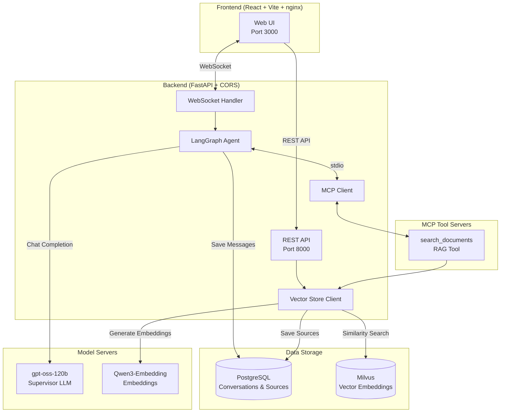
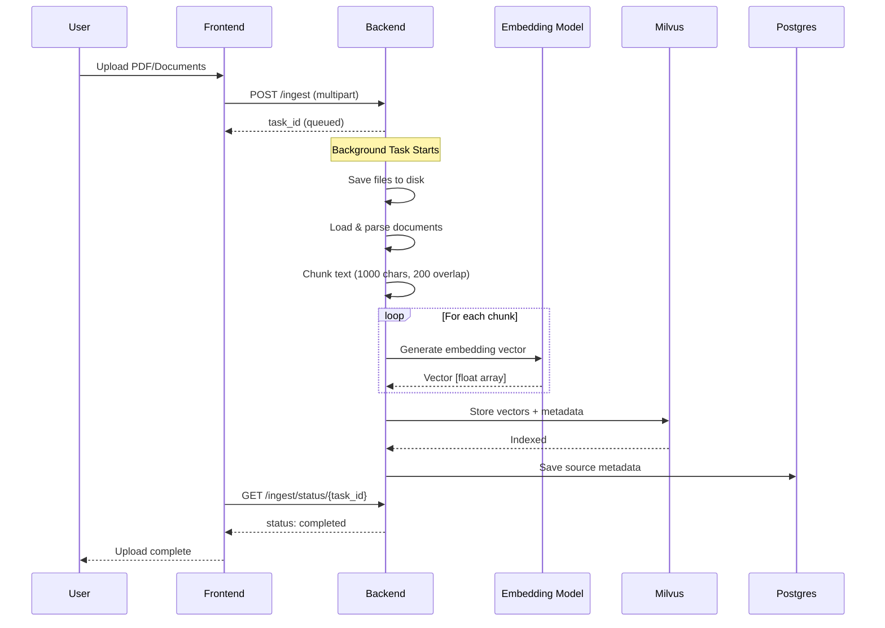
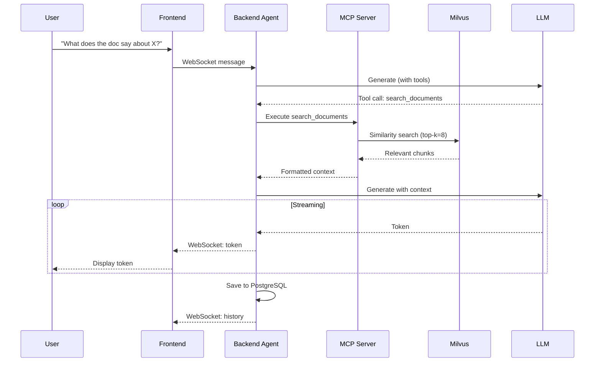

# Build and Deploy a RAG Agent Chatbot

> Deploy a rag-agent chatbot system and chat with agents on your Spark

## Table of Contents

- [Overview](#overview)
- [Architecture](#architecture)
  - [System Overview](#system-overview)
  - [Document Ingestion Flow](#document-ingestion-flow)
  - [RAG Query Flow](#rag-query-flow)
  - [Component Details](#component-details)
- [Instructions](#instructions)
- [Troubleshooting](#troubleshooting)

---

## Overview

## Basic idea

This playbook shows you how to use DGX Spark to prototype, build, and deploy a fully local RAG chatbot system.
With 128GB of unified memory, DGX Spark can run LLMs locally with sufficient headroom for document retrieval workloads.

At the core is a supervisor agent powered by gpt-oss-120B, orchestrating document retrieval through MCP (Model Context Protocol) tool servers.
The system focuses on retrieval-augmented generation (RAG), enabling users to upload documents and ask questions grounded in their content.
Thanks to DGX Spark's out-of-the-box support for popular AI frameworks and libraries, development and prototyping are fast and frictionless.

## Architecture

### System Overview



### Document Ingestion Flow



### RAG Query Flow



### Component Details

| Component | Technology | Purpose |
|-----------|------------|---------|
| **Frontend** | React, Vite, Tailwind, nginx | Static web UI served by nginx |
| **Backend** | FastAPI, LangGraph, CORS | API server, agent orchestration, WebSocket handler |
| **Vector Store** | Milvus | Document embeddings, similarity search |
| **Conversations** | PostgreSQL | Chat history, document sources |
| **Supervisor LLM** | vLLM (gpt-oss-120b) | Main reasoning, tool selection |
| **Vision Model** | vLLM (Qwen2.5-VL) | Image understanding |
| **Embeddings** | vLLM (Qwen3-Embedding) | Document vectorization |
| **MCP Servers** | Python (stdio) | Tool implementations |

## Prerequisites

- Access to the Azure DevOps project and K3s cluster
- Azure Container Registry (ACR) credentials stored in Azure Key Vault
- PostgreSQL and Milvus services running in the cluster

## Deployment

This project deploys via Azure DevOps CI/CD pipelines to a Kubernetes (K3s) cluster.

### Step 1. Clone the repository

```bash
git clone <repository-url>
cd rag-agent-chatbot
```

### Step 2. Deploy

Push to the `main` branch to trigger the CI/CD pipelines. The pipelines will:
1. Build and test the backend and frontend
2. Build container images and push to Azure Container Registry
3. Generate Kustomize manifests and deploy to the K3s cluster

### Step 3. Try it out

Upload a document using the "Upload Documents" button in the sidebar under "Context", select it in the "Select Sources" section, then ask questions about its content.

## Troubleshooting

| Symptom | Cause | Fix |
|---------|--------|-----|
| `ImagePullBackOff` | ACR ExternalSecret not synced | Check `kubectl get externalsecret -n rag-agent` and verify Key Vault secrets exist |
| Pod not ready | Backend dependencies (PostgreSQL, Milvus) unreachable | Check pod logs with `kubectl logs -l app=rag-agent-backend -n rag-agent` |
