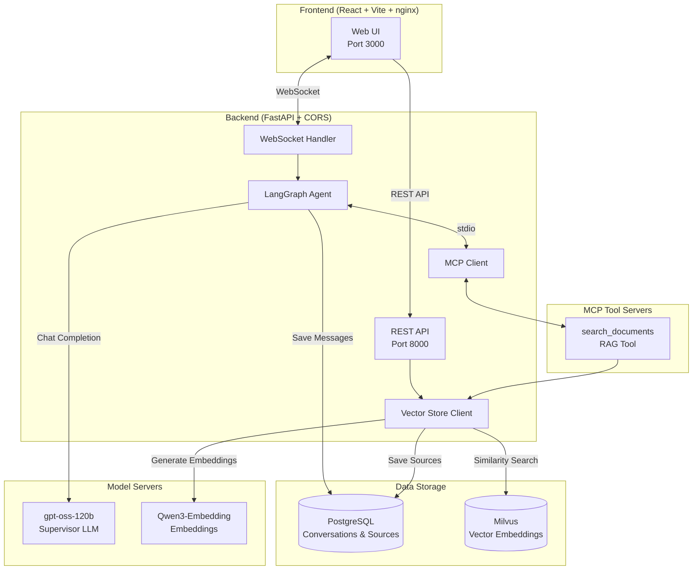
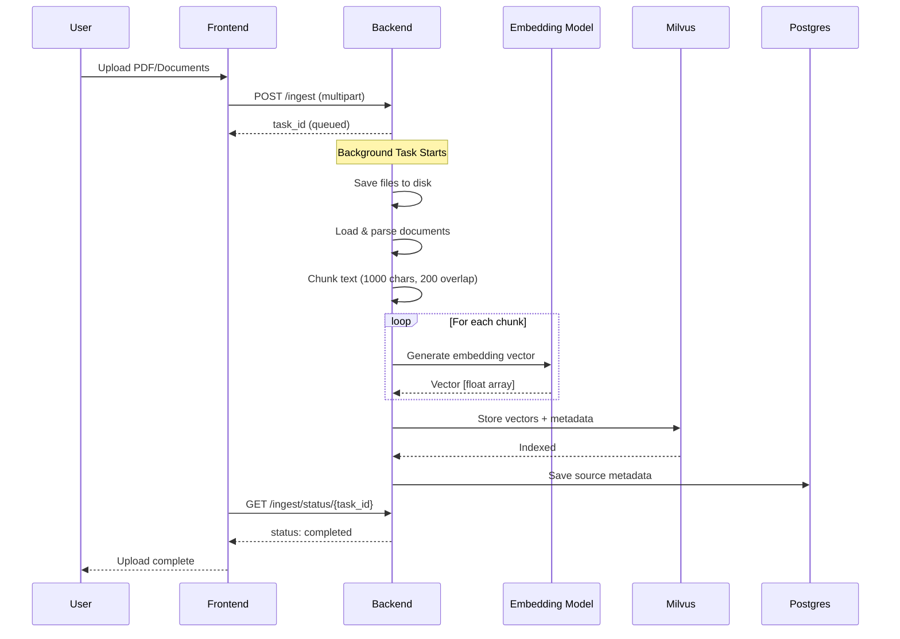
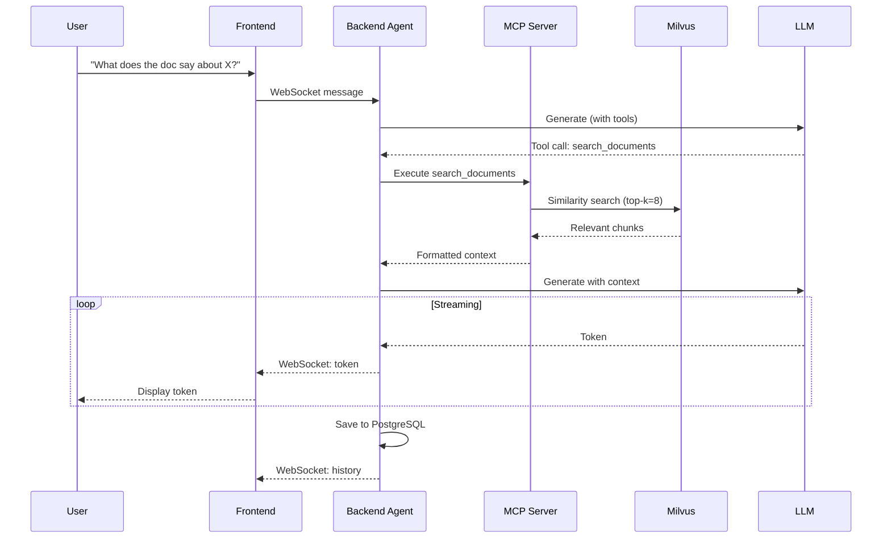

# Build and Deploy a RAG Agent Chatbot

> Deploy a rag-agent chatbot system and chat with agents on your Spark

## Table of Contents

- [Overview](#overview)
- [Architecture](#architecture)
  - [System Overview](#system-overview)
  - [Document Ingestion Flow](#document-ingestion-flow)
  - [RAG Query Flow](#rag-query-flow)
  - [Component Details](#component-details)
- [Instructions](#instructions)
- [Troubleshooting](#troubleshooting)

---

## Overview

## Basic idea

This playbook shows you how to use DGX Spark to prototype, build, and deploy a fully local RAG chatbot system.
With 128GB of unified memory, DGX Spark can run LLMs locally with sufficient headroom for document retrieval workloads.

At the core is a supervisor agent powered by gpt-oss-120B, orchestrating document retrieval through MCP (Model Context Protocol) tool servers.
The system focuses on retrieval-augmented generation (RAG), enabling users to upload documents and ask questions grounded in their content.
Thanks to DGX Spark's out-of-the-box support for popular AI frameworks and libraries, development and prototyping are fast and frictionless.

## Architecture

### System Overview



### Document Ingestion Flow



### RAG Query Flow



### Component Details

| Component | Technology | Purpose |
|-----------|------------|---------|
| **Frontend** | React, Vite, Tailwind, nginx | Static web UI served by nginx |
| **Backend** | FastAPI, LangGraph, CORS | API server, agent orchestration, WebSocket handler |
| **Vector Store** | Milvus | Document embeddings, similarity search |
| **Conversations** | PostgreSQL | Chat history, document sources |
| **Supervisor LLM** | vLLM (gpt-oss-120b) | Main reasoning, tool selection |
| **Vision Model** | vLLM (Qwen2.5-VL) | Image understanding |
| **Embeddings** | vLLM (Qwen3-Embedding) | Document vectorization |
| **MCP Servers** | Python (stdio) | Tool implementations |

## What you'll accomplish

You will have a full-stack rag-agent chatbot system running on your DGX Spark, accessible through
your local web browser. 
The setup includes:
- LLM and VLM model serving using llama.cpp servers and TensorRT LLM servers
- GPU acceleration for both model inference and document retrieval
- Multi-agent system orchestration using a supervisor agent powered by gpt-oss-120B
- MCP (Model Context Protocol) servers as tools for the supervisor agent

## Prerequisites

-  DGX Spark device is set up and accessible
-  No other processes running on the DGX Spark GPU
-  Enough disk space for model downloads

> [!NOTE]
> This demo uses ~120 out of the 128GB of DGX Spark's memory by default. 
> Please ensure that no other workloads are running on your Spark using `nvidia-smi`, or switch to a smaller supervisor model like gpt-oss-20B.


## Time & risk

* **Estimated time**: 30 minutes to an hour
* **Risks**:
  * Docker permission issues may require user group changes and session restart
  * Setup includes downloading model files for gpt-oss-120B (~63GB), Deepseek-Coder:6.7B-Instruct (~7GB) and Qwen3-Embedding-4B (~4GB), which may take between 30 minutes to 2 hours depending on network speed
* **Rollback**: Stop and remove Docker containers using provided cleanup commands.

## Instructions

## Step 1. Configure Docker permissions

To easily manage containers without sudo, you must be in the `docker` group. If you choose to skip this step, you will need to run Docker commands with sudo.

Open a new terminal and test Docker access. In the terminal, run:

```bash
docker ps
```

If you see a permission denied error (something like permission denied while trying to connect to the Docker daemon socket), add your user to the docker group so that you don't need to run the command with sudo .

```bash
sudo usermod -aG docker $USER
newgrp docker
```

## Step 2. Clone the repository

```bash
git clone https://github.com/NVIDIA/dgx-spark-playbooks
cd dgx-spark-playbooks/nvidia/rag-agent-chatbot/assets
```

## Step 3. Run the model download script

```bash
chmod +x model_download.sh
./model_download.sh
```

The setup script will take care of pulling model GGUF files from HuggingFace. 
The model files being pulled include gpt-oss-120B (~63GB), Deepseek-Coder:6.7B-Instruct (~7GB) and Qwen3-Embedding-4B (~4GB). 
This may take between 30 minutes to 2 hours depending on network speed.


## Step 4. Start the docker containers for the application

```bash
  docker compose -f docker-compose.yml -f docker-compose-models.yml up -d --build
```
This step builds the base llama.cpp server image and starts all the required docker services to serve models, the backend API server as well as the frontend UI. 
This step can take 10 to 20 minutes depending on network speed.
Wait for all the containers to become ready and healthy.

```bash
watch 'docker ps --format "table {{.ID}}\t{{.Names}}\t{{.Status}}"'
```

## Step 5. Access the frontend UI

Open your browser and go to: http://localhost:3000

> [!NOTE]
> If you are running this on a remote GPU via an SSH connection, in a new terminal window, you need to run the following command to be able to access the UI at localhost:3000 and for the UI to be able to communicate to the backend at localhost:8000.

>```ssh -L 3000:localhost:3000 -L 8000:localhost:8000  username@IP-address```

## Step 6. Try out the sample prompts

Click on any of the tiles on the frontend to try out the supervisor and the other agents.

**RAG Agent**:
Before trying out the example prompt for the RAG agent, upload the example PDF document [NVIDIA Blackwell Whitepaper](https://images.nvidia.com/aem-dam/Solutions/geforce/blackwell/nvidia-rtx-blackwell-gpu-architecture.pdf) 
as context by going to the link, downloading the PDF to the local filesystem, clicking on the green "Upload Documents" button in the left sidebar under "Context", and then make sure to check the box in the "Select Sources" section.

## Step 8. Cleanup and rollback

Steps to completely remove the containers and free up resources.

From the root directory of the rag-agent-chatbot project, run the following commands:

```bash
docker compose -f docker-compose.yml -f docker-compose-models.yml down

docker volume rm "$(basename "$PWD")_postgres_data"
```

## Step 9. Next steps

- Try different prompts with the rag-agent chatbot system.
- Try different models by following the instructions in the repository.
- Try adding new MCP (Model Context Protocol) servers as tools for the supervisor agent.

## Troubleshooting

| Symptom | Cause | Fix |
|---------|--------|-----|
| Cannot access gated repo for URL | Certain HuggingFace models have restricted access | Regenerate your [HuggingFace token](https://huggingface.co/docs/hub/en/security-tokens); and request access to the [gated model](https://huggingface.co/docs/hub/en/models-gated#customize-requested-information) on your web browser |

> [!NOTE]
> DGX Spark uses a Unified Memory Architecture (UMA), which enables dynamic memory sharing between the GPU and CPU. 
> With many applications still updating to take advantage of UMA, you may encounter memory issues even when within 
> the memory capacity of DGX Spark. If that happens, manually flush the buffer cache with:
```bash
sudo sh -c 'sync; echo 3 > /proc/sys/vm/drop_caches'
```
