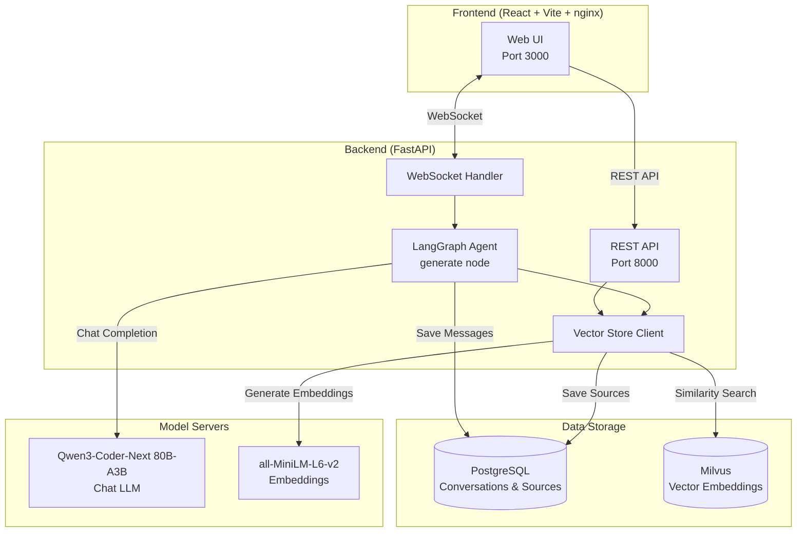
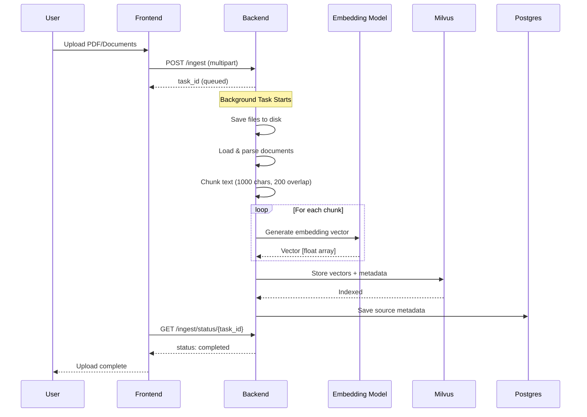
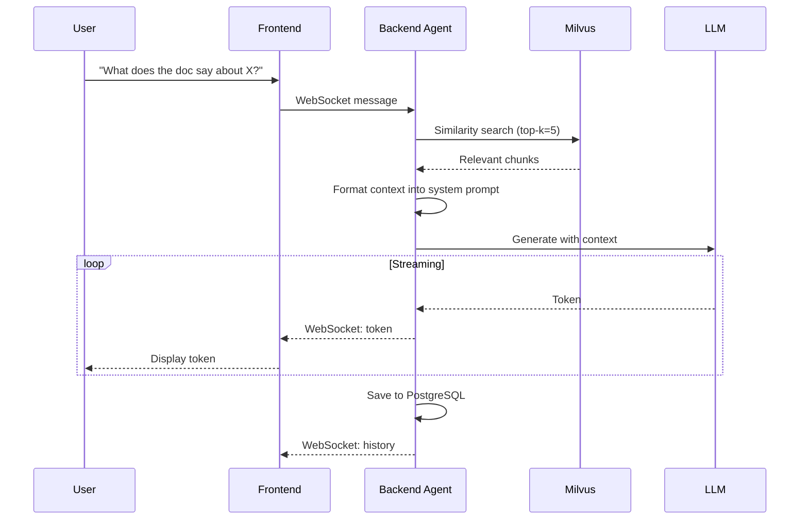

# Build and Deploy a RAG Agent Chatbot

> Deploy a RAG agent chatbot system and chat with agents on your Spark

## Table of Contents

- [Overview](#overview)
- [Architecture](#architecture)
  - [System Overview](#system-overview)
  - [Document Ingestion Flow](#document-ingestion-flow)
  - [RAG Query Flow](#rag-query-flow)
  - [Component Details](#component-details)
- [Getting Started](#getting-started)
- [Troubleshooting](#troubleshooting)

---

## Overview

This project shows you how to use DGX Spark to prototype, build, and deploy a fully local RAG chatbot system.
With 128GB of unified memory, DGX Spark can run LLMs locally with sufficient headroom for document retrieval workloads.

The system uses a direct RAG pipeline — inline vector search followed by a single LLM generation pass — to answer questions grounded in uploaded documents.
Users can upload documents and ask questions, with responses generated exclusively from retrieved content.
Thanks to DGX Spark's out-of-the-box support for popular AI frameworks and libraries, development and prototyping are fast and frictionless.

## Architecture

### System Overview



### Document Ingestion Flow



### RAG Query Flow



### Component Details

| Component | Technology | Purpose |
|-----------|------------|---------|
| **Frontend** | React, Vite, Tailwind, nginx | Static web UI served by nginx |
| **Backend** | FastAPI, LangGraph | API server, RAG pipeline, WebSocket handler |
| **Vector Store** | Milvus | Document embeddings, similarity search |
| **Conversations** | PostgreSQL | Chat history, document sources |
| **Chat LLM** | vLLM (Nemotron Nano 30B) | Response generation from retrieved context |
| **Embeddings** | all-MiniLM-L6-v2 | Document vectorization |

## Getting Started

### Prerequisites

- Kubernetes cluster (K3s or similar)
- PostgreSQL and Milvus services running in the cluster
- Container registry for storing built images
- JWT-based auth service providing JWKS endpoint

### Step 1. Clone the repository

```bash
git clone <repository-url>
cd rag-agent-chatbot
```

### Step 2. Configure

Set up your environment-specific Kustomize overlays. See [Kubernetes Deployment](docs/kubernetes-deployment.md) for details.

### Step 3. Deploy

Build container images for the backend and frontend, push to your container registry, and apply the Kustomize manifests:

```bash
# Build and push images
docker build -t <registry>/rag-agent-chatbot-backend:latest assets/backend
docker build -t <registry>/rag-agent-chatbot-frontend:latest assets/frontend

# Deploy
kubectl apply -k kustomize/backend/overlays/dev
kubectl apply -k kustomize/frontend/overlays/dev
```

### Step 4. Try it out

Upload a document using the "Upload Documents" button in the sidebar under "Context", select it in the "Select Sources" section, then ask questions about its content.

## Troubleshooting

| Symptom | Cause | Fix |
|---------|--------|-----|
| `ImagePullBackOff` | Container registry credentials not configured | Check image pull secrets in the namespace |
| Pod not ready | Backend dependencies (PostgreSQL, Milvus) unreachable | Check pod logs with `kubectl logs -l app=rag-agent-backend -n rag-agent` |
| WebSocket errors | Auth token expired or missing | Check browser console for 401 responses |
