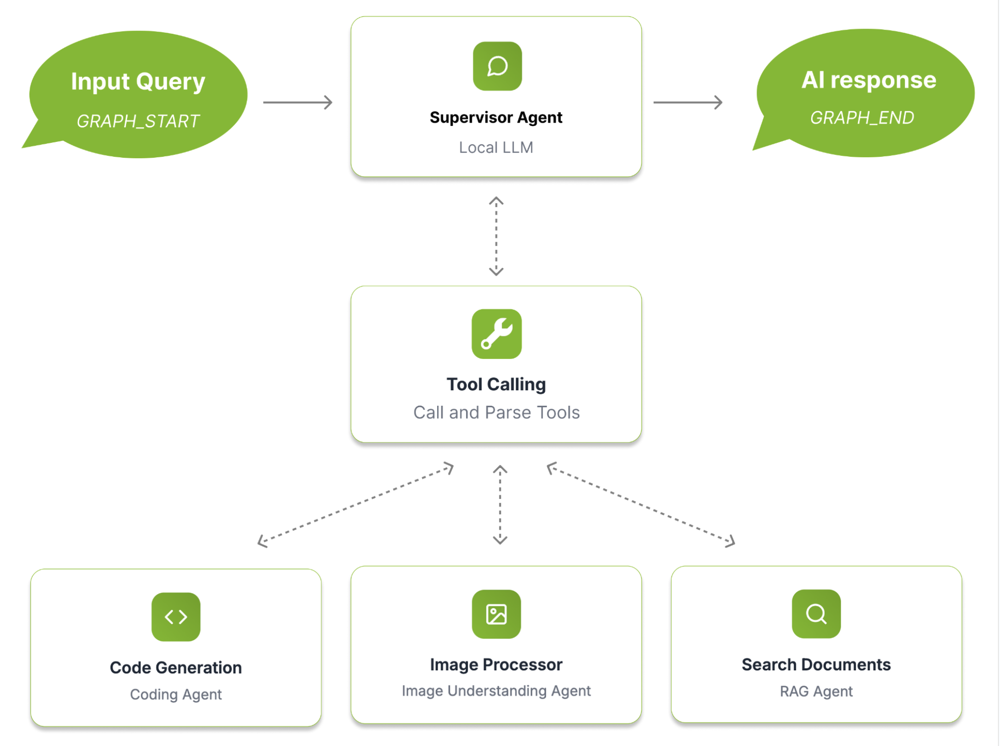

# Spark Chat: A Local RAG Chatbot for DGX Spark

## Project Overview

Spark Chat is a fully local RAG-powered chatbot built for DGX Spark. It uses a supervisor agent powered by GPT-OSS-120B to orchestrate document retrieval and question-answering through MCP (Model Context Protocol) tool servers.

The system focuses on document ingestion and retrieval-augmented generation (RAG), allowing users to upload documents and ask questions grounded in their content. All processing runs locally on DGX Spark hardware.

> **Note**: This demo uses ~70 out of the 128GB of DGX Spark's memory by default, so ensure that no other workloads are running on your Spark using `nvidia-smi` or switch to a smaller supervisor model like gpt-oss-20B.

This project is designed to be customizable, serving as a framework that developers can extend.

## Key Features
  - **MCP Server Integration**: Connects to custom MCP servers through a configurable multi-server client

  - **Tool Calling**: Uses an agents-as-tools framework with a supervisor agent that decides when to invoke document search

  - **Swappable Models**: Models are served through the OpenAI API. Any OpenAI-compatible model can be integrated

  - **Vector Indexing & Retrieval**: Milvus-powered document retrieval with batched embeddings for fast ingestion

  - **Real-time LLM Streaming**: Custom streaming infrastructure with WebSocket auto-reconnection and token batching

  - **LRU Caching**: Bounded in-memory caches with TTL expiration prevent memory leaks on long-running servers

  - **Configurable CORS & File Limits**: Environment-driven CORS origins and upload size limits for production deployments

## System Overview


## Default Models
| Model                | Quantization | Model Type | VRAM        |
|----------------------|--------------|------------|-------------|
| GPT-OSS:120B         | MXFP4        | Chat       | ~ 63.5 GB   |
| Qwen3-Embedding-4B   | Q8           | Embedding  | ~ 5.39 GB   |

**Total VRAM required:** ~69 GB

> **Warning**:
> If the default model uses too much VRAM, switch to `gpt-oss-20b` following [this guide](#using-different-models).

---

## Quick Start
#### 1. Clone the repository and change directories to the rag-agent chatbot directory.

#### 2. Configure docker permissions
```bash
sudo usermod -aG docker $USER
newgrp docker
```

> **Warning**: After running usermod, you may need to reboot using `sudo reboot` to start a new
> session with updated group permissions.

#### 3. Run the model download script
The setup script pulls model GGUF files from HuggingFace including gpt-oss-120B (~63GB) and Qwen3-Embedding-4B (~4GB). This may take between 30 minutes to 2 hours depending on network speed.
```bash
chmod +x model_download.sh
./model_download.sh
```

#### 4. Start the docker containers for the application
This step builds the base llama cpp server image and starts all the required docker services. This step can take 10 to 20 minutes depending on network speed.
```bash
docker compose -f docker-compose.yml -f docker-compose-models.yml up -d --build
```

Wait for all the containers to become ready and healthy.
```bash
watch 'docker ps --format "table {{.ID}}\t{{.Names}}\t{{.Status}}"'
```

#### 5. Access the frontend UI

Open your browser and go to: [http://localhost:3000](http://localhost:3000)

> Note: If you are running this on a remote GPU via an SSH connection, in a new terminal window, run:
>```bash
> ssh -L 3000:localhost:3000 -L 8000:localhost:8000 username@IP-address
>```

#### 6. Try it out
Upload a document using the "Upload Documents" button in the sidebar under "Context", select it in the "Select Sources" section, then ask questions about its content.

## Cleanup

From the root directory of the rag-agent-chatbot project:

```bash
docker compose -f docker-compose.yml -f docker-compose-models.yml down

docker volume rm "$(basename "$PWD")_postgres_data"
sudo sh -c 'sync; echo 3 > /proc/sys/vm/drop_caches'
```

## Customizations

### Using different models

1. In `setup.sh`, uncomment the line to download gpt-oss-20b.
2. In `docker-compose-models.yml`, uncomment the block for gpt-oss-20b.
3. In `docker-compose.yml`, add `gpt-oss-20b` to the `MODELS` environment variable.

### Environment Configuration

| Variable | Description | Default |
|----------|-------------|---------|
| `MODELS` | Comma-separated model names | `gpt-oss-120b` |
| `CORS_ALLOWED_ORIGINS` | Comma-separated allowed origins | `http://localhost:3000` |
| `MAX_UPLOAD_SIZE_MB` | Maximum file upload size in MB | `50` |
| `POSTGRES_HOST` | PostgreSQL hostname | `postgres` |
| `MILVUS_ADDRESS` | Milvus connection URI | `tcp://milvus:19530` |

### Adding MCP servers and tools

1. Add MCP servers under [backend/tools/mcp_servers](backend/tools/mcp_servers/) following existing examples.
2. Register new servers in the server configs in [backend/client.py](backend/client.py).
