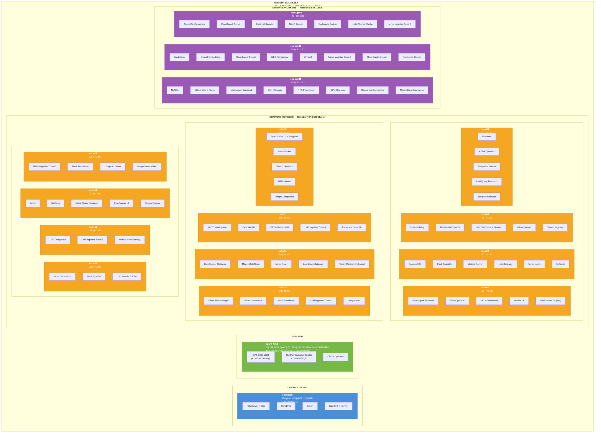
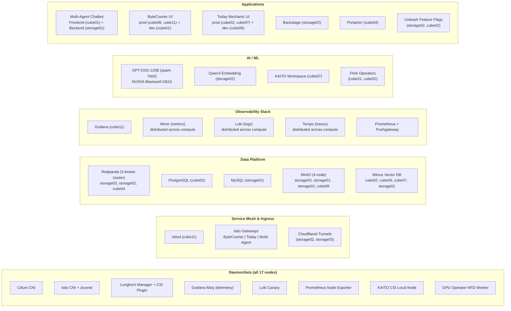
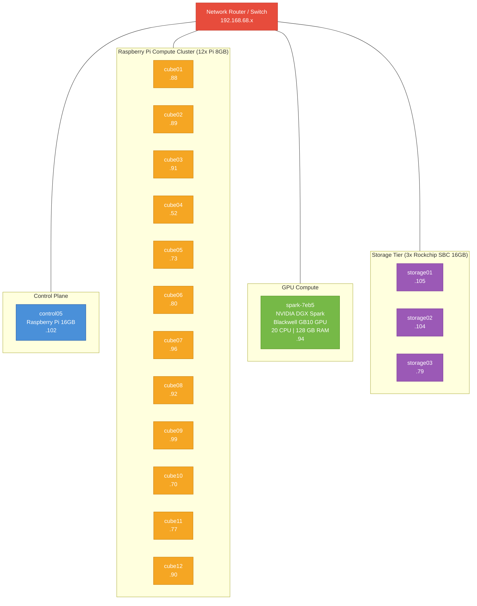

# Device Architecture Diagram

> Auto-generated from live kubectl inspection on 2026-02-09

## Cluster Overview

**K3s v1.33.6** cluster running on **17 ARM64 nodes** across 4 hardware tiers on the `192.168.68.x` network.

| Tier | Nodes | Hardware | CPU | RAM | Kernel |
|------|-------|----------|-----|-----|--------|
| Control Plane | 1 | Raspberry Pi (16GB) | 4 | 16 GB | `raspi` |
| Compute Workers | 12 | Raspberry Pi (8GB) | 4 | 8 GB | `raspi` |
| GPU | 1 | NVIDIA DGX Spark (Blackwell GB10) | 20 | 128 GB | `nvidia` |
| Storage Workers | 3 | Rockchip SBC | 8 | 16 GB | `rockchip` |

**Totals:** 17 nodes, 96 CPU cores, 336 GB RAM, 1x NVIDIA Blackwell GB10 GPU

## Device Architecture

## Platform Services Distributed Across Nodes

## Physical Topology

