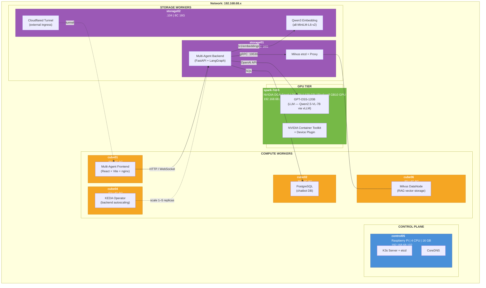
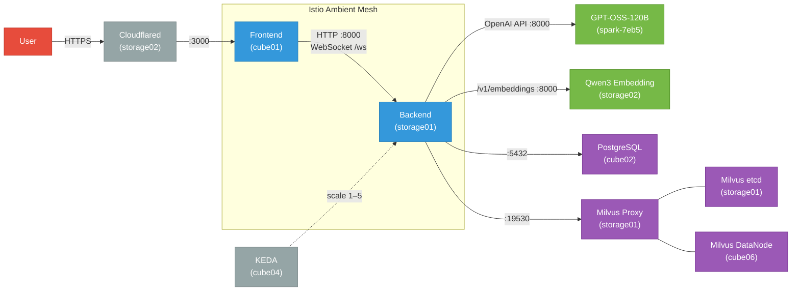

# Multi-Agent Chatbot — Device Architecture

> Nodes used by the multi-agent-chatbot in K8s (subset of the 17-node K3s v1.33.6 ARM64 cluster on `192.168.68.x`)

## Nodes Overview

The multi-agent-chatbot runs across **8 nodes** spanning all 4 hardware tiers:

| Node | Tier | Hardware | CPU | RAM | Chatbot Role |
|------|------|----------|-----|-----|--------------|
| control05 | Control Plane | Raspberry Pi 16GB | 4 | 16 GB | K3s API / CoreDNS |
| cube01 | Compute | Raspberry Pi 8GB | 4 | 8 GB | Frontend |
| cube02 | Compute | Raspberry Pi 8GB | 4 | 8 GB | PostgreSQL (chatbot DB) |
| cube04 | Compute | Raspberry Pi 8GB | 4 | 8 GB | KEDA Operator (autoscaling) |
| cube06 | Compute | Raspberry Pi 8GB | 4 | 8 GB | Milvus DataNode (RAG vectors) |
| spark-7eb5 | GPU | NVIDIA DGX Spark | 20 | 128 GB | GPT-OSS-120B (LLM inference) |
| storage01 | Storage | Rockchip SBC 16GB | 8 | 16 GB | Backend + Milvus etcd/Proxy |
| storage02 | Storage | Rockchip SBC 16GB | 8 | 16 GB | Qwen3 Embedding + Cloudflared ingress |

## Device Architecture

## Service Connectivity

## Key Configuration

| Component | Namespace | Service DNS | Port |
|-----------|-----------|-------------|------|
| Frontend | multi-agent-dev | multi-agent-frontend.multi-agent-dev.svc.cluster.local | 3000 |
| Backend | multi-agent-dev | multi-agent-backend.multi-agent-dev.svc.cluster.local | 8000 |
| GPT-OSS-120B | multi-agent-dev | gpt-oss-120b.multi-agent-dev.svc.cluster.local | 8000 |
| Qwen3 Embedding | multi-agent-dev | qwen3-embedding.multi-agent-dev.svc.cluster.local | 8000 |
| PostgreSQL | postgres-system | postgresql.postgres-system.svc.cluster.local | 5432 |
| Milvus | milvus-system | milvus.milvus-system.svc.cluster.local | 19530 |

### Backend Autoscaling (KEDA)

- **Min/Max Replicas:** 1–5
- **Triggers:** CPU > 70%, Memory > 80%
- **Scale Up:** +2 pods per 30s
- **Scale Down:** -25% per 60s (120s stabilization)

### Istio Routing

- **WebSocket** (`/ws`): No timeout, 0 retries (client reconnects)
- **HTTP** (`/`): 300s timeout, 2 retries on 5xx/reset/connect-failure
- **Load Balancing:** Consistent hash on `chatId` query param (session affinity)
