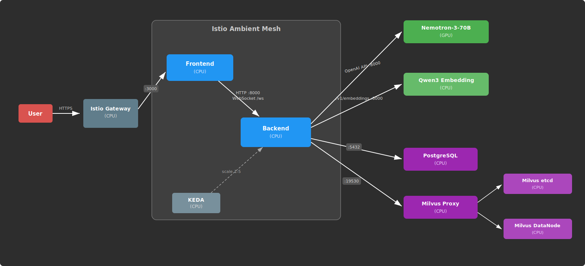

# Spark Chat: A Local RAG Chatbot for DGX Spark

## Project Overview

Spark Chat is a fully local RAG-powered chatbot built for DGX Spark. It uses a supervisor agent powered by Nemotron-Super-49B to orchestrate document retrieval and question-answering through MCP (Model Context Protocol) tool servers.

The system focuses on document ingestion and retrieval-augmented generation (RAG), allowing users to upload documents and ask questions grounded in their content. All processing runs locally on DGX Spark hardware.

> **Note**: This demo uses the DGX Spark's unified memory, so ensure that no other GPU workloads are running on your Spark using `nvidia-smi`.

This project is designed to be customizable, serving as a framework that developers can extend.

## Key Features
  - **MCP Server Integration**: Connects to custom MCP servers through a configurable multi-server client

  - **Tool Calling**: Uses an agents-as-tools framework with a supervisor agent that decides when to invoke document search

  - **Swappable Models**: Models are served through the OpenAI API. Any OpenAI-compatible model can be integrated

  - **Vector Indexing & Retrieval**: Milvus-powered document retrieval with batched embeddings for fast ingestion

  - **Real-time LLM Streaming**: Custom streaming infrastructure with WebSocket auto-reconnection and token batching

  - **LRU Caching**: Bounded in-memory caches with TTL expiration prevent memory leaks on long-running servers

  - **Same-Origin API Routing**: Backend served behind `/api/backend-svc` on the frontend hostname via Istio Gateway URLRewrite, eliminating CORS entirely in production

  - **Configurable File Limits**: Environment-driven upload size limits for production deployments

## System Overview


## Default Models
| Model                | Quantization | Model Type | VRAM        |
|----------------------|--------------|------------|-------------|
| Nemotron-Super-49B   | FP8 (pre-quantized) | Chat | ~ 25 GB |
| Qwen3-Embedding-4B   | Q8           | Embedding  | ~ 5.39 GB   |

**Total VRAM required:** ~30 GB

---

## Quick Start

#### 1. Clone the repository
```bash
git clone <repository-url>
cd rag-agent-chatbot
```

#### 2. Deploy to Kubernetes
Build container images, push to your registry, and apply Kustomize manifests. See the [README](../README.md) for detailed deployment instructions.

#### 3. Try it out
Upload a document using the "Upload Documents" button in the sidebar under "Context", select it in the "Select Sources" section, then ask questions about its content.

## Customizations

### Environment Configuration

| Variable | Description | Default |
|----------|-------------|---------|
| `MODELS` | Comma-separated model names | `nemotron-super-49b` |
| `CORS_ALLOWED_ORIGINS` | Comma-separated allowed origins | `http://localhost:3000` |
| `MAX_UPLOAD_SIZE_MB` | Maximum file upload size in MB | `50` |
| `POSTGRES_HOST` | PostgreSQL hostname | `postgres` |
| `MILVUS_ADDRESS` | Milvus connection URI | `tcp://milvus:19530` |

### Adding MCP servers and tools

1. Add MCP servers under [assets/backend/tools/mcp_servers](../assets/backend/tools/mcp_servers/) following existing examples.
2. Register new servers in the server configs in [assets/backend/client.py](../assets/backend/client.py).
